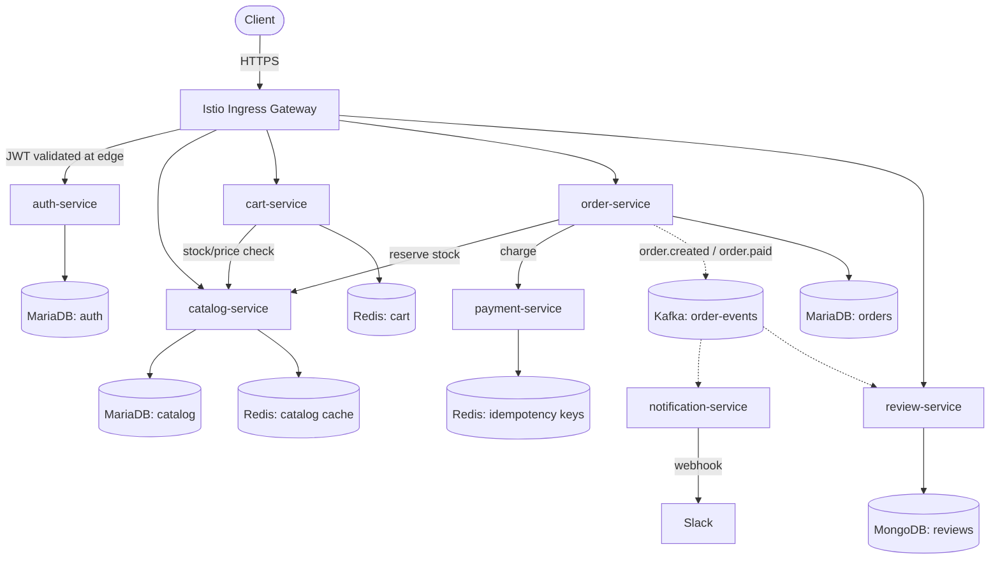

# Gestalt Commerce

A near-production e-commerce microservices system, built as a hands-on demonstration of Kubernetes, Istio/Envoy service mesh, GitOps delivery, and full-stack observability. Business logic is intentionally shallow — the point of this project is the infrastructure, not the app.

> "Infrastructure intelligence. The whole greater than the parts." — Gestalt Systems

## Why this project exists

This is built specifically to close three gaps identified against production-grade DevOps/Infra roles:

1. **Production-grade Kubernetes** — beyond a single nginx Deployment: multi-service dependency graphs, StatefulSets, ConfigMap/Secret management, NetworkPolicy, HPA.
2. **Service mesh depth** — not just "mTLS is on," but JWT validation at the edge, authorization policy matrices, circuit breakers, fault injection, and canary traffic shifting under real load.
3. **Operational maturity** — GitOps delivery, alerting that actually pages someone, and documented incident postmortems from deliberately engineered failures.

Every design decision below is chosen to produce a concrete, defensible interview story — not to maximize the number of technologies touched.

## Architecture at a glance

Solid arrows = synchronous REST over mTLS. Dashed arrows = asynchronous, via Kafka.

## Service inventory

| Service | Responsibility | Datastore | Doc |
|---|---|---|---|
| auth-service | Login, JWT issuance, token revocation | MariaDB + Redis | [services/auth-service.md](services/auth-service.md) |
| catalog-service | Product catalog, stock, price | MariaDB + Redis (cache-aside) | [services/catalog-service.md](services/catalog-service.md) |
| cart-service | Ephemeral shopping cart | Redis only | [services/cart-service.md](services/cart-service.md) |
| order-service | Checkout orchestration, saga coordinator | MariaDB | [services/order-service.md](services/order-service.md) |
| payment-service | Mocked payment processing, idempotent charges | Redis (idempotency) | [services/payment-service.md](services/payment-service.md) |
| notification-service | Async order notifications | none (stateless consumer) | [services/notification-service.md](services/notification-service.md) |
| review-service | Post-purchase reviews & ratings | MongoDB | [services/review-service.md](services/review-service.md) |

## Tech stack

| Layer | Choice | Why |
|---|---|---|
| Orchestration | Kubernetes (local: Docker Desktop → EKS via Terraform) | matches your current learning path |
| Service mesh | Istio + Envoy | mTLS, L7 routing, JWT-at-edge, circuit breaking |
| Messaging | Kafka | at-least-once delivery, consumer group semantics |
| Relational data | MariaDB | you already own replication/failover on this in production |
| Document data | MongoDB | reuses your replica-set rotation experience, adds a second data paradigm |
| Cache | Redis | cache-aside pattern, idempotency keys, ephemeral cart state |
| Metrics | Prometheus + Grafana | golden signals + a business dashboard |
| Service graph | Kiali | live traffic visualization |
| Tracing | Jaeger | cross-service request tracing |
| Delivery | Argo CD (+ optional Argo Rollouts) | GitOps, canary automation |
| Load testing | K6 | scripted checkout flow, integrates with Grafana |
| IaC | Terraform | cluster provisioning on EKS |

## Documentation index

| Doc | Covers |
|---|---|
| [docs/01-architecture-overview.md](docs/01-architecture-overview.md) | Full dependency graph, data ownership, saga flow |
| [docs/02-api-contracts.md](docs/02-api-contracts.md) | REST endpoints + Kafka event schemas |
| [docs/03-kubernetes-deployment.md](docs/03-kubernetes-deployment.md) | Namespaces, manifests, ConfigMap/Secret, NetworkPolicy, HPA |
| [docs/04-istio-service-mesh.md](docs/04-istio-service-mesh.md) | mTLS, JWT-at-edge, AuthorizationPolicy, circuit breakers, fault injection, canary |
| [docs/05-observability-stack.md](docs/05-observability-stack.md) | Prometheus, Grafana, Kiali, Jaeger, alerting |
| [docs/06-resilience-and-chaos-engineering.md](docs/06-resilience-and-chaos-engineering.md) | 5 deep failure scenarios with postmortem template |
| [docs/07-gitops-and-progressive-delivery.md](docs/07-gitops-and-progressive-delivery.md) | Argo CD app-of-apps, canary automation |
| [docs/08-load-testing.md](docs/08-load-testing.md) | K6 checkout-flow script and thresholds |
| [docs/09-build-roadmap.md](docs/09-build-roadmap.md) | Week-by-week build plan from Docker Desktop to EKS |

## Quick start (progression)

1. **Local (current stage):** Docker Desktop Kubernetes. Deploy all services + Redis/MariaDB/MongoDB/Kafka as single-replica local workloads. Get Istio mesh, mTLS, and basic Grafana/Kiali working end to end.
2. **EKS:** Provision via Terraform (VPC, node groups, IAM/OIDC). Redeploy the same manifests through Argo CD instead of `kubectl apply`. Add HPA and real load via K6.
3. **Simulate production:** Run the 5 chaos scenarios in [docs/06](docs/06-resilience-and-chaos-engineering.md), execute one canary rollout, write postmortems for each.

Each stage is independently demoable — you don't need to reach EKS to have a strong interview story.
