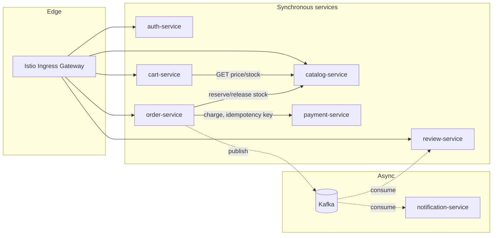
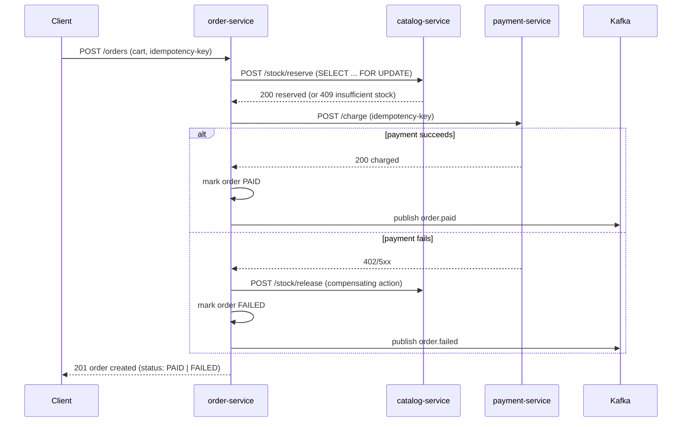

# Architecture Overview

## Design principles

- **Database per service.** No service reaches into another service's database. Every cross-service data need goes through an API call or an event. This is the single most important rule for the project to read as "real" rather than "demo."
- **Sync for read-your-writes needs, async for everything else.** Stock reservation and payment must complete before the client gets a response. Notifications and review-eligibility do not.
- **The mesh does what the mesh is good at.** JWT validation and mTLS happen at the Envoy layer, not re-implemented in every service. Application code stays business-logic-only.
- **Failure is a first-class feature, not an afterthought.** Every synchronous dependency has an explicit timeout, retry budget, and circuit breaker defined in Istio config, documented in [04-istio-service-mesh.md](04-istio-service-mesh.md).

## Full dependency graph

Note: `order-service` does **not** call `auth-service` synchronously per request. JWTs are validated by Envoy at the ingress gateway via `RequestAuthentication` (JWKS pulled from `auth-service`'s public key endpoint). `auth-service` is only hit directly for login/refresh — this is a deliberate mesh-offload decision, not an oversight, and is worth calling out explicitly in an interview.

## Data ownership

| Service | Owns | Never accessed directly by |
|---|---|---|
| auth-service | users, credentials, refresh tokens | any other service |
| catalog-service | products, stock counts, prices | any other service — order-service calls the reservation API, never touches the table |
| cart-service | cart contents (Redis, TTL 24h) | any other service |
| order-service | orders, order line items, saga state | any other service |
| payment-service | idempotency key → result mapping | any other service |
| review-service | reviews, ratings | any other service |

## Checkout flow (the core saga)

Checkout is the one flow that actually exercises the distributed-transaction problem you flagged as your SDI gap — two-phase writes across services that don't share a transaction. `order-service` acts as the **saga orchestrator**.

Key points worth being able to explain out loud:
- **Idempotency key** is generated client-side (or at the gateway) and passed through to `payment-service`. If `order-service` retries the charge call after a timeout, `payment-service` returns the cached result instead of charging twice — see [payment-service.md](../services/payment-service.md).
- **Stock reservation uses row-level locking** (`SELECT ... FOR UPDATE`) inside `catalog-service`, the same primitive from your TinyURL SDI session, applied here to prevent overselling under concurrent checkouts.
- **Compensating transaction**: if payment fails after stock was reserved, `order-service` explicitly calls `/stock/release` — this is the orchestration-based saga pattern, as opposed to choreography (event-only, no central coordinator). Orchestration is the right choice here because the flow is short and the failure modes need to be deterministic.

## Communication modes matrix

| From → To | Mode | Protocol | Delivery guarantee |
|---|---|---|---|
| Client → Gateway | Sync | HTTPS | — |
| Gateway → any service | Sync | HTTP/JSON over mTLS (Envoy) | at-most-once per call, retried per VirtualService policy |
| cart-service → catalog-service | Sync | HTTP/JSON | retried, circuit-broken |
| order-service → catalog-service | Sync | HTTP/JSON | retried, circuit-broken |
| order-service → payment-service | Sync | HTTP/JSON | retried with idempotency key |
| order-service → Kafka | Async | Kafka producer | at-least-once (ack=all) |
| Kafka → notification-service | Async | Kafka consumer group | at-least-once, manual offset commit after processing |
| Kafka → review-service | Async | Kafka consumer group | at-least-once |

All synchronous inter-service traffic is transparently intercepted and encrypted by Envoy sidecars — no service ever sees a plaintext connection to another service in the mesh. See [04-istio-service-mesh.md](04-istio-service-mesh.md) for the exact PeerAuthentication and AuthorizationPolicy configuration.
